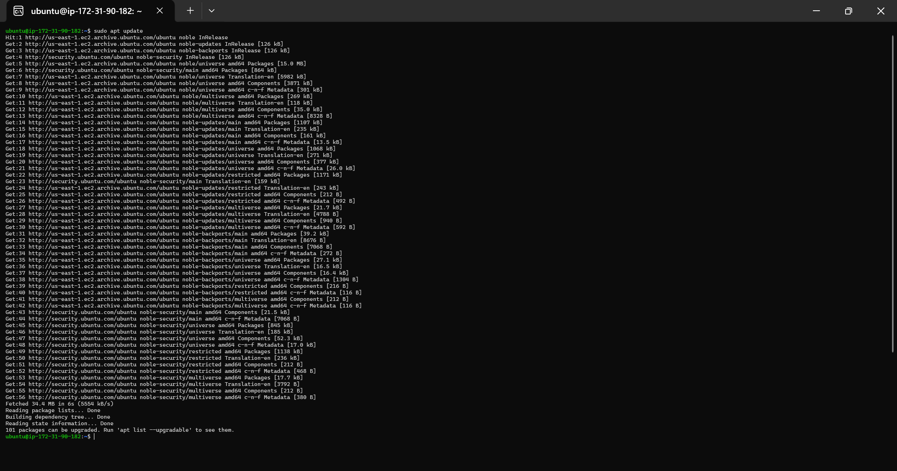
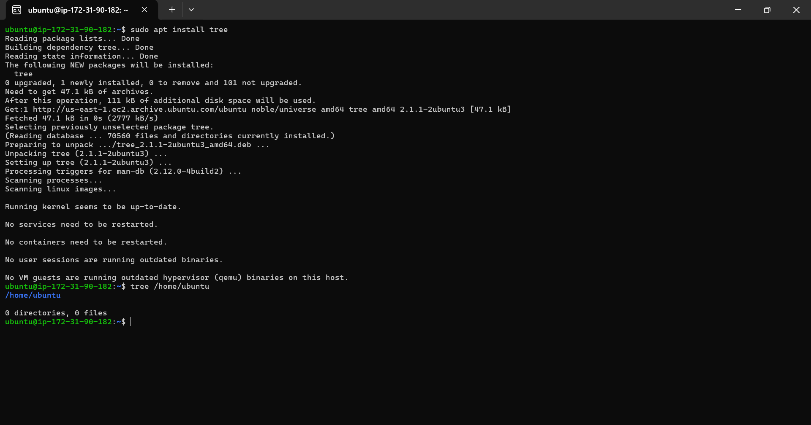
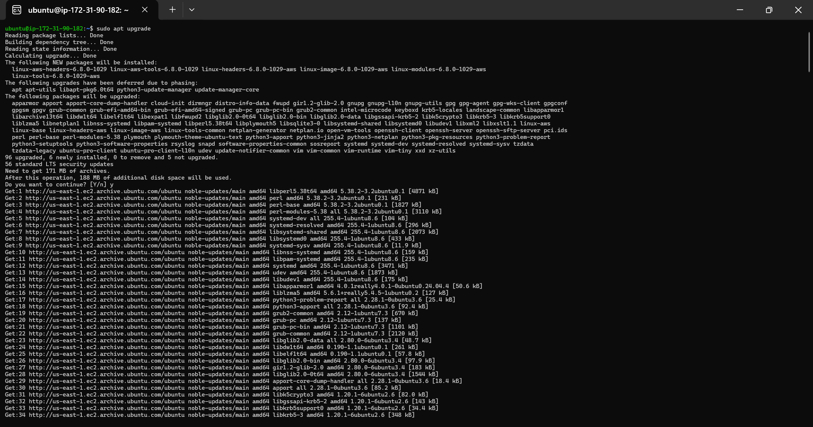
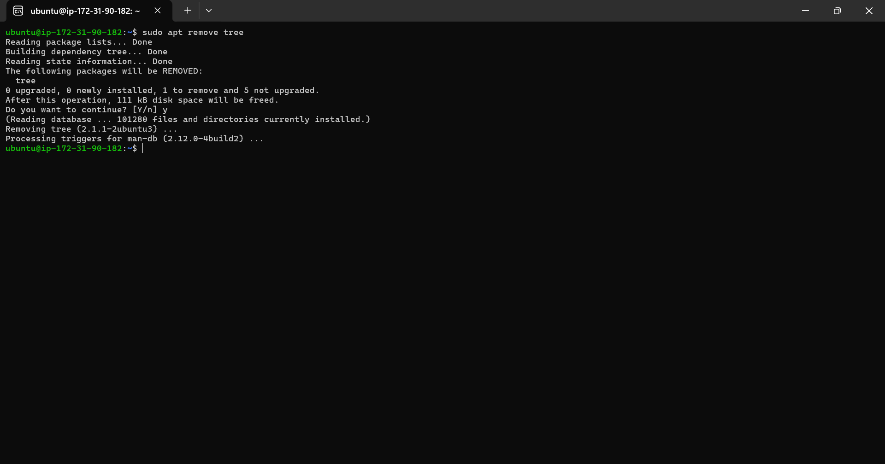
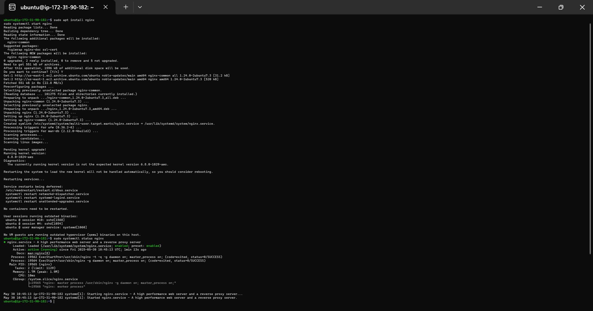
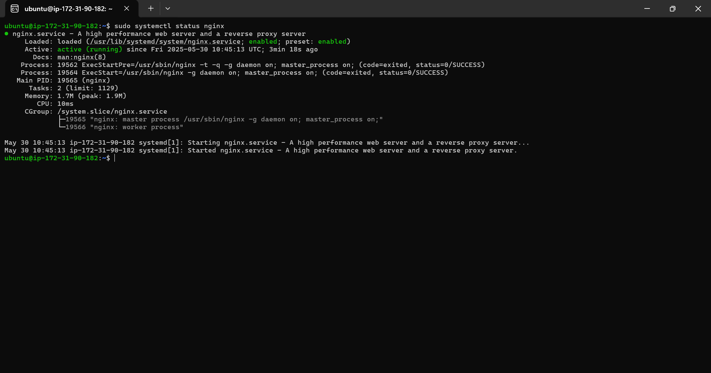
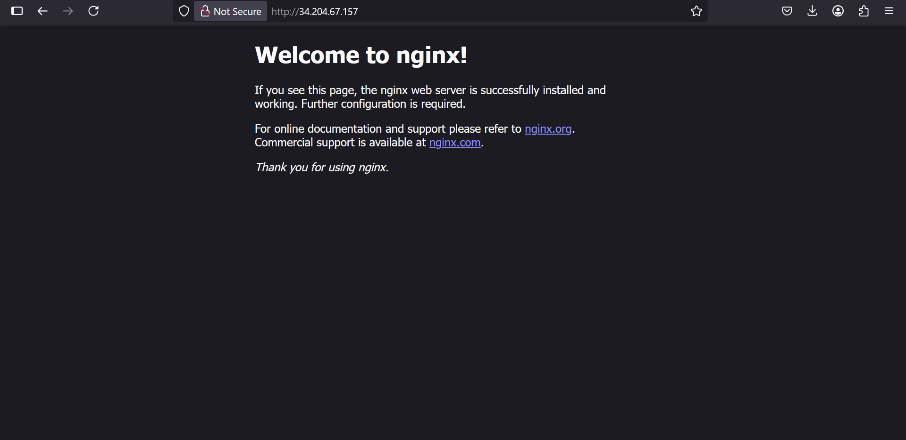

# Linux-Fundamentals-Project
# Introduction to Linux

## Project Overview
This project introduces Linux by setting up an Ubuntu server on AWS EC2, connecting via SSH using the Ubuntu terminal (WSL), and performing package management with `apt`. I installed, verified, updated, and removed `tree`, and explored `nginx`.

## Steps Taken

### Installation and Initial Setup
- Installed WSL and Ubuntu on Windows to use the Ubuntu terminal.
- Created an AWS EC2 Ubuntu Server (`t2.micro`).
- Connected to the server using SSH from the Ubuntu terminal (WSL):

- **Screenshot**: Successful SSH connection:

### Package Management
- Updated package lists: sudo apt update

- Installed `tree`: sudo apt install tree
- Verified with:tree /home/ubuntu
- **Screenshot**: `tree` output:

- Updated packages:sudo apt upgrade

- Removed `tree`:sudo apt remove tree

- Installed `nginx`:sudo apt install nginx
  sudo systemctl start nginx

- Verified `nginx` status and accessed its welcome page.
- **Screenshot**: `nginx` status:

- **Screenshot**: `nginx` welcome page:

## Tools Used
- **Ubuntu Terminal (WSL)**: For SSH and package management.
- **VS Code**: For creating this documentation.
- **AWS EC2**: For hosting the Ubuntu server.
- **GitHub**: For hosting the documentation.

## Lessons Learned
- WSL enables Ubuntu terminal usage on Windows.
- SSH securely connects to remote servers.
- `apt` simplifies package management on Ubuntu.

## Repository Link
[GitHub Repository](https://github.com/westgrin/Linux-Fundamentals-Project)

## Conclusion
This project provided hands-on experience with Linux on a cloud server, using the Ubuntu terminal for all operations.
